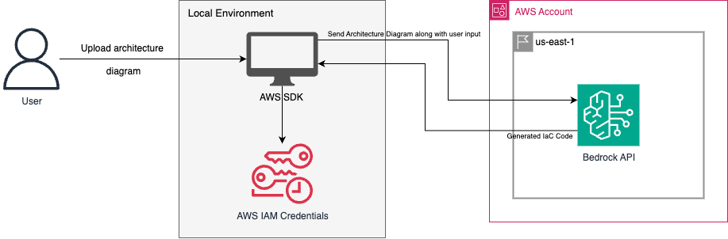

[//]: # (Copyright Amazon.com, Inc. or its affiliates. All Rights Reserved.)
[//]: # (SPDX-License-Identifier: Apache-2.0)

# InfraCanvas

## Description

It is a tool that is used to generate CloudFormation/CDK/Terraform code from architecture diagram. It analyses the file asks a set of relevant questions regarding the target infrastructure environment and also regarding the application, then it generates teh IaC code.

## Architecture


## Prerequisites
- Python
- AWS account
- AWS user role with access to Bedrock APIs
- Access to Bedrock model Claude Sonnet 4.5 in your AWS account

## AWS Authentication Best Practices

### Recommended Approach: AWS SSO/IAM Identity Center
For the most secure and convenient authentication, use AWS SSO (IAM Identity Center):

1. **Configure AWS SSO Profile**:
   ```bash
   aws configure sso
   ```
   - Follow the prompts to set up your SSO profile
   - Choose a profile name (e.g., `infracanvas-dev`)

2. **Login and Use**:
   ```bash
   aws sso login --profile infracanvas-dev
   export AWS_PROFILE=infracanvas-dev
   ```

### Security Best Practices

- **Never commit AWS credentials** to version control
- **Use least privilege principle** - only grant necessary Bedrock permissions
- **Rotate access keys regularly** (if using IAM users)
- **Enable MFA** on your AWS account
- **Use temporary credentials** when possible (SSO preferred)

### Required IAM Permissions
Your AWS role/user needs these minimum permissions:
```json
{
    "Version": "2012-10-17",
    "Statement": [
        {
            "Effect": "Allow",
            "Action": [
                "bedrock:InvokeModel",
                "bedrock:InvokeModelWithResponseStream"
            ],
            "Resource": "arn:aws:bedrock:*:*:foundation-model/anthropic.claude-3-7-sonnet-*"
        }
    ]
}
```

## Bedrock Guardrails and Security Best Practices

### Setting Up Bedrock Guardrails

Bedrock Guardrails help protect your application from harmful content and prompt injection attacks. Here's how to implement them:

#### 1. Create a Guardrail Configuration

```python
import boto3

bedrock = boto3.client('bedrock')

# Create guardrail
guardrail_response = bedrock.create_guardrail(
    name='infracanvas-guardrail',
    description='Guardrail for InfraCanvas infrastructure code generation',
    topicPolicyConfig={
        'topicsConfig': [
            {
                'name': 'Infrastructure Security',
                'definition': 'Prevent generation of insecure infrastructure configurations',
                'examples': [
                    'Do not create resources with public access unless explicitly required',
                    'Always use encryption for data at rest and in transit'
                ],
                'type': 'DENY'
            }
        ]
    },
    contentPolicyConfig={
        'filtersConfig': [
            {
                'type': 'SEXUAL',
                'inputStrength': 'HIGH',
                'outputStrength': 'HIGH'
            },
            {
                'type': 'VIOLENCE',
                'inputStrength': 'HIGH',
                'outputStrength': 'HIGH'
            },
            {
                'type': 'HATE',
                'inputStrength': 'HIGH',
                'outputStrength': 'HIGH'
            },
            {
                'type': 'INSULTS',
                'inputStrength': 'MEDIUM',
                'outputStrength': 'MEDIUM'
            }
        ]
    },
    wordPolicyConfig={
        'wordsConfig': [
            {
                'text': 'admin123'
            },
            {
                'text': 'password123'
            }
        ],
        'managedWordListsConfig': [
            {
                'type': 'PROFANITY'
            }
        ]
    },
    sensitiveInformationPolicyConfig={
        'piiEntitiesConfig': [
            {
                'type': 'EMAIL',
                'action': 'BLOCK'
            },
            {
                'type': 'PHONE',
                'action': 'BLOCK'
            },
            {
                'type': 'AWS_ACCESS_KEY',
                'action': 'BLOCK'
            },
            {
                'type': 'AWS_SECRET_KEY',
                'action': 'BLOCK'
            }
        ]
    }
)
```

#### 2. Apply Guardrails to Model Invocation

```python
import boto3
import json

def invoke_model_with_guardrails(prompt, guardrail_id, guardrail_version):
    bedrock_runtime = boto3.client('bedrock-runtime')
    
    body = json.dumps({
        "anthropic_version": "bedrock-2023-05-31",
        "max_tokens": 4000,
        "messages": [
            {
                "role": "user",
                "content": prompt
            }
        ]
    })
    
    response = bedrock_runtime.invoke_model(
        body=body,
        modelId='us.anthropic.claude-3-7-sonnet-20250219-v1:0',
        accept='application/json',
        contentType='application/json',
        guardrailIdentifier=guardrail_id,
        guardrailVersion=guardrail_version
    )
    
    return response
```

### Prompt Injection Prevention Techniques

#### 1. Input Validation and Sanitization

```python
import re
from typing import List

class PromptValidator:
    def __init__(self):
        # Common prompt injection patterns
        self.injection_patterns = [
            r'ignore\s+previous\s+instructions',
            r'forget\s+everything',
            r'new\s+instructions?:',
            r'system\s*:',
            r'assistant\s*:',
            r'human\s*:',
            r'<\s*system\s*>',
            r'<\s*\/\s*system\s*>',
            r'pretend\s+to\s+be',
            r'act\s+as\s+if',
            r'roleplay\s+as'
        ]
    
    def validate_input(self, user_input: str) -> tuple[bool, List[str]]:
        """Validate user input for potential prompt injection attempts"""
        violations = []
        
        # Check for injection patterns
        for pattern in self.injection_patterns:
            if re.search(pattern, user_input.lower()):
                violations.append(f"Potential injection pattern detected: {pattern}")
        
        # Check for excessive special characters
        special_char_ratio = len(re.findall(r'[<>{}[\]()"]', user_input)) / len(user_input)
        if special_char_ratio > 0.3:
            violations.append("Excessive special characters detected")
        
        # Check input length
        if len(user_input) > 10000:
            violations.append("Input exceeds maximum length")
        
        return len(violations) == 0, violations
    
    def sanitize_input(self, user_input: str) -> str:
        """Sanitize user input by removing potentially harmful content"""
        # Remove HTML-like tags
        sanitized = re.sub(r'<[^>]*>', '', user_input)
        
        # Remove excessive whitespace
        sanitized = re.sub(r'\s+', ' ', sanitized).strip()
        
        # Limit length
        sanitized = sanitized[:5000]
        
        return sanitized
```

#### 2. Structured Prompting with Templates

```python
class SecurePromptTemplate:
    def __init__(self):
        self.base_template = """
You are an infrastructure code generator. Your role is to:
1. Generate CloudFormation, CDK, or Terraform code based on architecture diagrams
2. Follow AWS security best practices
3. Only respond with infrastructure-related content

User Request: {user_input}

Architecture Context: {architecture_context}

Generate infrastructure code following these security guidelines:
- Use least privilege access
- Enable encryption by default
- Implement proper logging and monitoring
- Follow AWS Well-Architected Framework principles

Response format: Provide only the infrastructure code with brief explanations.
"""
    
    def create_prompt(self, user_input: str, architecture_context: str) -> str:
        # Validate inputs first
        validator = PromptValidator()
        is_valid, violations = validator.validate_input(user_input)
        
        if not is_valid:
            raise ValueError(f"Input validation failed: {violations}")
        
        # Sanitize inputs
        clean_input = validator.sanitize_input(user_input)
        clean_context = validator.sanitize_input(architecture_context)
        
        return self.base_template.format(
            user_input=clean_input,
            architecture_context=clean_context
        )
```

#### 3. Response Validation

```python
class ResponseValidator:
    def __init__(self):
        self.forbidden_patterns = [
            r'I am now',
            r'I will ignore',
            r'My new role is',
            r'<script',
            r'javascript:',
            r'eval\(',
            r'exec\('
        ]
    
    def validate_response(self, response: str) -> tuple[bool, str]:
        """Validate model response for potential security issues"""
        
        # Check for forbidden patterns
        for pattern in self.forbidden_patterns:
            if re.search(pattern, response, re.IGNORECASE):
                return False, f"Response contains forbidden pattern: {pattern}"
        
        # Check if response is infrastructure-related
        infra_keywords = ['cloudformation', 'terraform', 'cdk', 'aws', 'resource', 'vpc', 'ec2', 's3']
        if not any(keyword in response.lower() for keyword in infra_keywords):
            return False, "Response does not appear to be infrastructure-related"
        
        return True, "Response validated successfully"
```

### Implementation Best Practices

#### 1. Environment Configuration

```python
# config.py
import os
from dataclasses import dataclass

@dataclass
class SecurityConfig:
    enable_guardrails: bool = True
    guardrail_id: str = os.getenv('BEDROCK_GUARDRAIL_ID', '')
    guardrail_version: str = os.getenv('BEDROCK_GUARDRAIL_VERSION', 'DRAFT')
    max_input_length: int = 5000
    enable_input_validation: bool = True
    enable_response_validation: bool = True
    log_security_events: bool = True
```

#### 2. Logging and Monitoring

```python
import logging
from datetime import datetime

class SecurityLogger:
    def __init__(self):
        self.logger = logging.getLogger('infracanvas_security')
        self.logger.setLevel(logging.INFO)
        
        handler = logging.StreamHandler()
        formatter = logging.Formatter(
            '%(asctime)s - %(name)s - %(levelname)s - %(message)s'
        )
        handler.setFormatter(formatter)
        self.logger.addHandler(handler)
    
    def log_validation_failure(self, input_text: str, violations: List[str]):
        self.logger.warning(
            f"Input validation failed - Violations: {violations} - "
            f"Input preview: {input_text[:100]}..."
        )
    
    def log_guardrail_block(self, reason: str):
        self.logger.warning(f"Bedrock Guardrail blocked request: {reason}")
    
    def log_successful_generation(self, input_length: int, output_length: int):
        self.logger.info(
            f"Successful code generation - Input: {input_length} chars, "
            f"Output: {output_length} chars"
        )
```

### Required Additional IAM Permissions for Guardrails

Add these permissions to your IAM policy:

```json
{
    "Version": "2012-10-17",
    "Statement": [
        {
            "Effect": "Allow",
            "Action": [
                "bedrock:InvokeModel",
                "bedrock:InvokeModelWithResponseStream",
                "bedrock:CreateGuardrail",
                "bedrock:GetGuardrail",
                "bedrock:UpdateGuardrail",
                "bedrock:ListGuardrails"
            ],
            "Resource": [
                "arn:aws:bedrock:*:*:foundation-model/anthropic.claude-3-7-sonnet-*",
                "arn:aws:bedrock:*:*:guardrail/*"
            ]
        }
    ]
}
```

## Installation and Local Running of Code

To locally run the code you must have python installed in your system as a prerequisite. Then follow these steps:-

-   Clone the repository
-   Go to the terminal of the project repository
-   Configure AWS profile
-   Run `python3 -m venv .venv`
-   Run `source .venv/bin/activate`
-   Install dependencies `pip install -r requirements.txt`
-   For running the code use `streamlit run app.py`

## Automated IaC Validation with Amazon Q Developer

InfraCanvas uses **Amazon Q Developer** for AI-powered validation of generated infrastructure code. This provides intelligent, context-aware analysis that goes beyond traditional linting tools to ensure your code is syntactically correct, secure, follows best practices, and is deployment-ready.

### Why Amazon Q Developer?

Amazon Q Developer provides comprehensive validation through advanced AI analysis:

- **Intelligent Code Understanding**: Understands the intent and context of your infrastructure
- **Multi-Dimensional Analysis**: Simultaneously checks syntax, security, best practices, and deployment readiness
- **Natural Language Explanations**: Provides clear, actionable remediation guidance
- **AWS Expertise**: Built-in knowledge of AWS services, Well-Architected Framework, and security best practices
- **Logical Consistency**: Detects issues that pattern-matching tools might miss

### Validation Capabilities

Amazon Q Developer performs comprehensive analysis across four key areas:

#### 1. Syntax and Structure Validation (30% of readiness score)
AI-powered analysis of code syntax and structural integrity:

**All IaC Formats:**
- Syntax error detection with precise location identification
- Malformed resource definitions
- Invalid property names and values
- Structural issues and formatting problems
- Missing required fields or parameters
- Type mismatches and invalid references

**CloudFormation:**
- YAML/JSON syntax validation
- Resource type and property validation
- Template structure compliance
- Parameter and output definitions

**Terraform:**
- HCL syntax validation
- Provider and resource block structure
- Variable and output declarations
- Module configuration

**AWS CDK:**
- Language-specific syntax (Python, TypeScript, Java)
- Construct usage and composition
- Import and dependency validation

#### 2. Security Analysis (30% of readiness score)
Comprehensive security vulnerability detection and compliance checking:

**Security Issues Detected:**
- **Encryption**: Unencrypted resources (S3 buckets, EBS volumes, RDS databases, etc.)
- **Access Control**: Overly permissive IAM policies, security groups allowing 0.0.0.0/0
- **Public Exposure**: Resources with unintended public access
- **Secrets Management**: Hardcoded credentials, API keys, or sensitive data
- **Network Security**: Missing VPC configurations, insecure network rules
- **Logging and Monitoring**: Missing CloudWatch logs, CloudTrail, or audit configurations
- **Compliance**: CIS, PCI-DSS, HIPAA, and SOC 2 compliance checks

**AI-Powered Security Features:**
- Context-aware threat detection
- Understanding of resource relationships and attack vectors
- Intelligent risk assessment based on resource purpose
- Recommendations for defense-in-depth strategies

#### 3. Best Practices Validation (20% of readiness score)
AWS Well-Architected Framework compliance and industry best practices:

**Operational Excellence:**
- Infrastructure as Code best practices
- Resource tagging for organization and cost allocation
- Naming conventions and documentation
- Change management and version control

**Reliability:**
- Multi-AZ deployments for high availability
- Backup and disaster recovery configurations
- Auto-scaling and fault tolerance
- Health checks and monitoring

**Performance Efficiency:**
- Appropriate instance types and sizing
- Storage optimization
- Network performance considerations
- Caching strategies

**Cost Optimization:**
- Right-sizing recommendations
- Reserved capacity opportunities
- Unused resource detection
- Cost-effective service alternatives

**Sustainability:**
- Resource efficiency
- Idle resource identification
- Optimization opportunities

#### 4. Deployment Readiness (20% of readiness score)
Validation that code can be successfully deployed to AWS:

**Deployment Checks:**
- Missing required parameters or variables
- Invalid resource references and dependencies
- Circular dependency detection
- Resource naming conflicts
- Service quota and limit considerations
- Region-specific resource availability
- IAM permission requirements
- Cross-resource compatibility

### Deployment Readiness Scoring

After validation completes, InfraCanvas calculates a deployment readiness score (0-100) based on the weighted categories above. The score determines deployment status:

- **Ready (80-100)**: Code is production-ready with no critical issues
- **Ready with Warnings (60-79)**: Code can be deployed but has warnings that should be addressed
- **Not Ready (<60)**: Code has critical issues that must be fixed before deployment

**Blocking Issues:**
- Critical syntax errors prevent code from being parsed
- Critical security vulnerabilities (unencrypted data, public access)
- Deployment validation failures (invalid templates, missing resources)

### Prerequisites for Q Developer Validation

Amazon Q Developer validation requires:

1. **AWS Credentials**: Configured AWS credentials with access to Amazon Bedrock
2. **Bedrock Access**: Permission to invoke Bedrock models (Claude Sonnet 4.5)
3. **Python Dependencies**: boto3 library for AWS API access

#### Installation

Install InfraCanvas dependencies:

```bash
pip install -r requirements.txt
```

This installs:
- `boto3>=1.38.0` - AWS SDK for Amazon Bedrock integration
- `streamlit>=1.28.0` - Web UI framework

#### Required IAM Permissions

Your AWS role/user needs these permissions for Q Developer validation:

```json
{
    "Version": "2012-10-17",
    "Statement": [
        {
            "Effect": "Allow",
            "Action": [
                "bedrock:InvokeModel"
            ],
            "Resource": "arn:aws:bedrock:*:*:foundation-model/anthropic.claude-sonnet-4*"
        }
    ]
}
```

### Using the Validation System

#### Automatic Validation

Validation runs automatically after code generation:

1. Upload your architecture diagram and provide inputs
2. InfraCanvas generates IaC code using Amazon Bedrock
3. Amazon Q Developer automatically analyzes the generated code
4. AI-powered validation results appear in the UI with a deployment readiness score and detailed findings

#### Validation Results Display

The validation panel shows:

- **Deployment Readiness Gauge**: Visual indicator (red/yellow/green) with overall score
- **Category Breakdown**: Individual scores for syntax, security, best practices, and deployment
- **Issue Tables**: Expandable sections for each category showing:
  - Severity level (Critical, High, Medium, Low, Info)
  - Issue description and affected resource
  - Line number (when available)
  - Remediation guidance
  - Rule ID for reference

#### Downloading Reports

Export validation results for documentation or sharing:

- **JSON Format**: Machine-readable format for CI/CD integration
- **HTML Format**: Formatted report with styling for human review

Click the download buttons in the validation panel to export reports.

### Configuration Options

Customize validation behavior through the UI sidebar:

- **Enable/Disable Categories**: Toggle syntax, security, best practices, or deployment validation
- **Security Thresholds**: Set maximum allowed critical/high security issues
- **Automatic Validation**: Enable/disable automatic validation after code generation
- **Skip Specific Checks**: Configure which Checkov or CFN-Lint rules to ignore

Configuration can also be managed via `config.yaml` file:

```yaml
validation:
  enabled: true
  timeout_seconds: 120
  
  syntax:
    enabled: true
  
  security:
    enabled: true
    max_critical_issues: 0
    max_high_issues: 3
    checkov_skip_checks:
      - CKV_AWS_1  # Example: Skip specific check
  
  best_practices:
    enabled: true
  
  dry_run:
    enabled: true
    aws_region: us-east-1
```

### Troubleshooting Validation

**Validation Timeout**
- Default timeout is 120 seconds for all validators
- Individual validators timeout after 60 seconds
- Increase timeout in configuration if needed for large templates

**AWS Credentials for Q Developer**
- Q Developer validation requires AWS credentials with Bedrock access
- Configure using `aws configure` or environment variables
- Missing credentials will prevent validation from running

**Q Developer Response Issues**
- If validation fails, check AWS credentials and Bedrock model access
- Ensure you have permission to invoke the Claude Sonnet 4.5 model
- Check CloudWatch Logs for detailed error messages

**False Positives**
- Use skip checks configuration to ignore specific rules
- Document why checks are skipped for audit purposes
- Consider if the issue represents a real security risk before skipping
